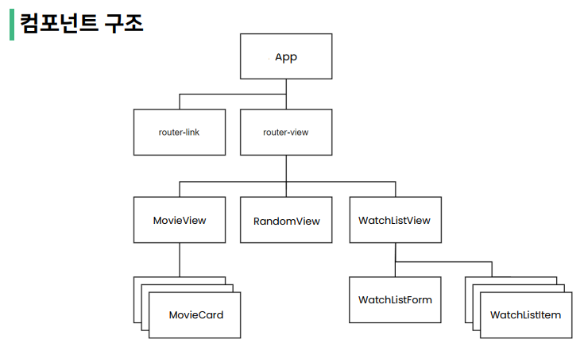
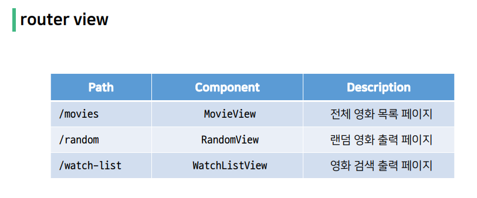
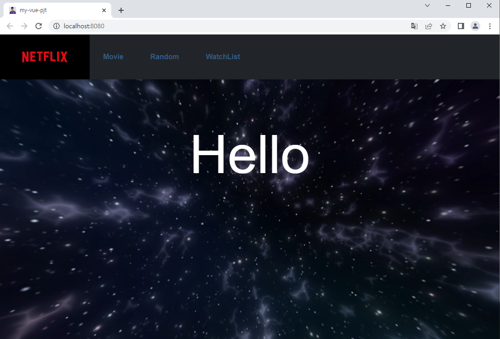
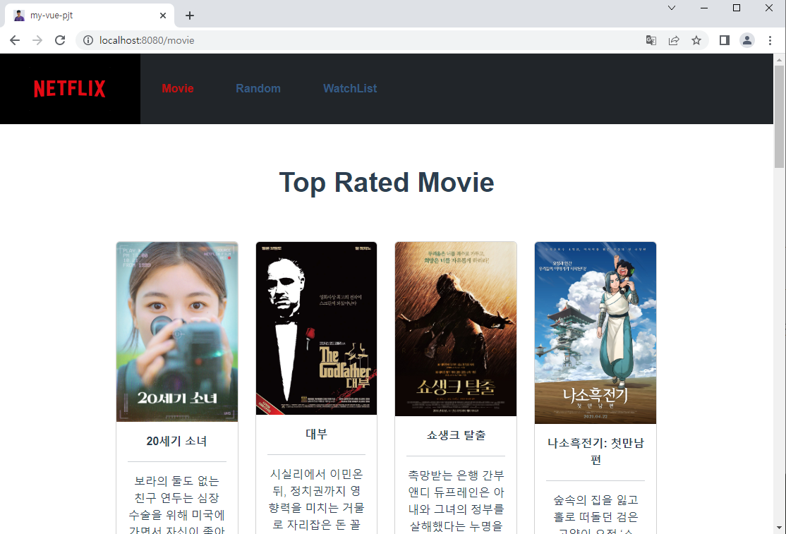
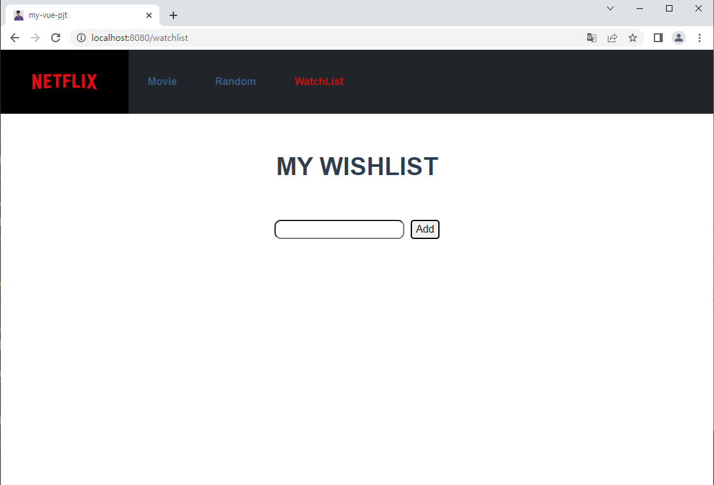

# 무 & 섭의 9번째 프로젝트
### requirement
	- Visual Studio Code
	- Google Chrome
	- Node.js LTS
	- Vue.js 2.x

#

#### 김송섭(main driver)
- Vue를 사용하면서 구조 파악이 용이하고 재사용을 통한 반복적인 구조를 표현하기 좋다고 느꼈습니다.
- 변경되는 값에 대해 state를 이용하여 데이터를 관리하기가 수월하였습니다.
- Vue에서 제공하는 router 기능을 통해 SPA를 개발할 수 있었습니다.
- 페어프로그래밍을 통한 프로젝트 구현하며 어떤 식으로 소통해야 서로에게 편안한 개발이 되는지 한 번 더 생각해보게 되었습니다.

#

#### 정무남(main navigator)
- vuex를 활용하여 vue파일에서 state에 있는 데이터를 가공하는 흐름과 방법을 익힘
- 여러 css 활용 방법을 익힘
- 전체 배경에 애니메이션이나 동영상 들을 넣는 방법을 배움
- api를 통해 데이터를 가져와서 사용하는 방법을 익힘
- 여러 이벤트가 발생했을 때 함수가 실행되는 과정을 복습함
- 클래스 바인딩등 여러 요소들은 바인딩 하는 연습을 함

>느낀점: 저번주에는 장고를 통해 영화 페이지를 만들었는데 오늘은 vue를 통해 영화 페이지를 만들었다. 눈에 보이는것들을 다루는 것은 vue를 통해 만드는 것이 훨씬 간편하다는 것을 느낄 수 있었다.
>다음주에는 장고와 vue를 같이 활용하여 만드는 것을 배운다는데 기대가 된다. 그리고 역시 혼자 프로젝트를 하는 것 보다 같이 협업을 통해 프로젝트를 진행했을 때 문제 해결이 훨씬 쉽고 빠르게 되었다. 지금까지의 프로젝트 경험을 바탕으로 다음주 부터 시작되는 1학기 마지막 프로젝트도 열심히 참여 해야겠다.
#
## Component Structure

#

#
### 결과
#### Main Page

#
#### Movie Page

#
#### WishList Page
